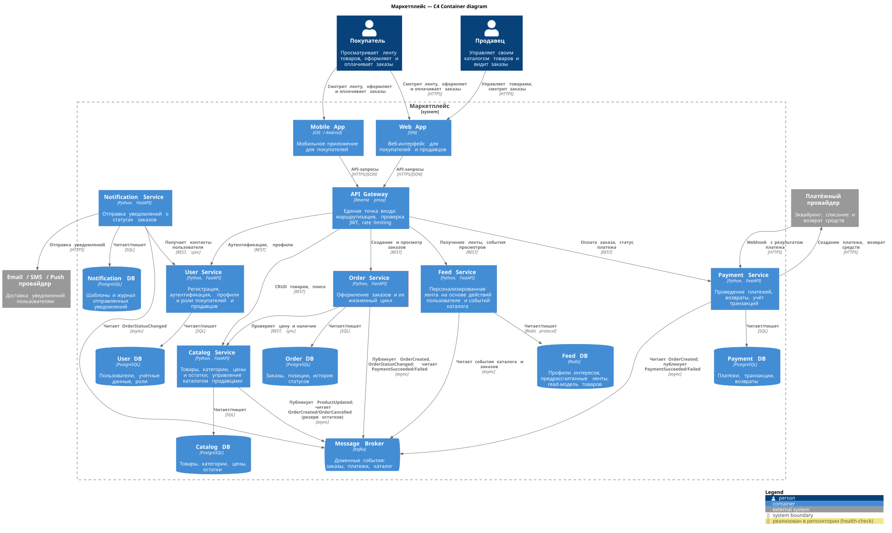

# Маркетплейс — архитектурное проектирование

Домашнее задание №1: архитектура маркетплейса (C4) и инициализация сервиса.

## C4 Container diagram



Исходник диаграммы: [`docs/c4-container.puml`](docs/c4-container.puml) (C4-PlantUML).

## Домены

| Домен | Зона ответственности |
|---|---|
| Пользователи | Регистрация и аутентификация покупателей и продавцов, профили, роли, контактные данные. Выдаёт JWT, по которому остальная система узнаёт пользователя. |
| Каталог | Товары продавцов: описание, категория, цена, остаток. Продавец управляет только своими товарами. Источник истины о цене и наличии; резервирует товар под заказ. |
| Лента | Собирает сигналы интересов покупателя и ранжирует по ним товары в персональную ленту (см. «Персонализация» ниже). |
| Заказы | Оформление заказа и его жизненный цикл: ожидание оплаты, оплачен, отправлен, доставлен, отменён. Фиксирует состав и цены на момент оформления. |
| Платежи | Приём оплаты через платёжного провайдера, возвраты, учёт транзакций. |
| Уведомления | Сообщения покупателю и продавцу о смене статуса заказа по email, SMS или push. |

**Персонализация.** Лента строится по правилам, без ML. Сигналы — просмотры товаров (приходят через API Gateway) и покупки (событие `OrderStatusChanged` со статусом `PAID`). Товары ранжируются по совпадению с категориями, которые покупатель смотрел и покупал, с учётом популярности; новому покупателю показываются популярные товары. Ленты пересчитываются по мере поступления сигналов и хранятся готовыми, поэтому запрос ленты — одно чтение из Redis.

## Распределение доменов по сервисам

Каждый домен — отдельный сервис. API Gateway домена не реализует: это технический компонент для маршрутизации, проверки JWT и rate limiting.

| Домен | Сервис | Почему отдельный сервис |
|---|---|---|
| Пользователи | User Service | Стабильный домен с повышенными требованиями к безопасности: пароли, выдача токенов. Не стоит на пути каждого запроса — JWT проверяет API Gateway по подписи. |
| Каталог | Catalog Service | Нагрузка в основном на чтение, продавцы пишут редко. Масштабируется независимо от заказов и остаётся единственным источником истины о цене и остатках. |
| Лента | Feed Service | Самый изменчивый домен: правила ранжирования меняются часто, и эксперименты не должны затрагивать каталог и заказы. Самая высокая нагрузка на чтение и собственное хранилище под неё. Сбой ленты не мешает искать и покупать. |
| Заказы | Order Service | Центр бизнес-процесса, требует строгой консистентности. Меняется вместе с правилами оформления, а не с лентой или способами оплаты. |
| Платежи | Payment Service | Работает с платёжным провайдером и финансовыми данными. Изоляция ограничивает требования безопасности (PCI DSS) одним сервисом и одной БД; смена провайдера затрагивает только его. |
| Уведомления | Notification Service | Нагрузка всплесками на события, зависимость от внешних провайдеров рассылки. Отдельный сервис не даёт их сбоям повлиять на оформление заказов. |

Границы сервисов совпадают с границами доменов (bounded context). Поэтому изменение бизнес-правила затрагивает один сервис (high cohesion), а сервисы знают друг о друге только API и события (low coupling). Дополнительно учтены различия в частоте изменений, профиле нагрузки и чувствительности данных — они перечислены в таблице.

## Владение данными

Каждый сервис владеет своей БД. Общих БД нет: другой сервис получает данные только через API владельца или из его событий.

| Сервис | Отвечает за | Владеет данными | Хранилище |
|---|---|---|---|
| User Service | учётные записи и аутентификацию | пользователи, хеши паролей, роли, контакты | PostgreSQL |
| Catalog Service | товары, цены и наличие | товары, категории, цены, остатки, резервы под заказы | PostgreSQL |
| Feed Service | персонализированную ленту | сигналы интересов, готовые ленты, read-модель товаров | Redis |
| Order Service | заказы и их статусы | заказы, позиции с ценой на момент оформления, история статусов | PostgreSQL |
| Payment Service | оплату и возвраты | платежи, транзакции провайдера, возвраты | PostgreSQL |
| Notification Service | доставку уведомлений | шаблоны, журнал отправок | PostgreSQL |

## Взаимодействие сервисов

Синхронно (REST) сервис обращается к другому, только когда без ответа не может продолжить работу. Всё остальное идёт асинхронно через Kafka: отправитель не ждёт получателя и не зависит от его доступности.

### Синхронные вызовы

| Откуда → куда | Зачем |
|---|---|
| Web / Mobile App → API Gateway | все запросы клиентов |
| API Gateway → User Service | регистрация, вход, профили |
| API Gateway → Catalog Service | управление товарами, поиск, карточка товара |
| API Gateway → Feed Service | лента, события просмотров |
| API Gateway → Order Service | оформление, просмотр, смена статуса продавцом |
| API Gateway → Payment Service | оплата заказа, статус платежа |
| Order Service → Catalog Service | проверка цены и резерв товара при оформлении |
| Notification Service → User Service | контакты получателя |
| Payment Service → платёжный провайдер | создание платежа, возврат |
| Платёжный провайдер → Payment Service | webhook с результатом платежа |
| Notification Service → Email / SMS / Push провайдер | доставка уведомления |

### Асинхронные события (Kafka)

| Событие | Публикует | Читают | Зачем |
|---|---|---|---|
| `ProductUpdated` | Catalog Service | Feed Service | обновить read-модель товаров |
| `OrderCreated` | Order Service | Payment Service | создать платёж на сумму заказа |
| `PaymentSucceeded` | Payment Service | Order Service | перевести заказ в `PAID` |
| `OrderStatusChanged` | Order Service | Catalog, Notification, Feed Service | Catalog списывает товар из резерва (`PAID`) или снимает резерв (`CANCELLED`); Notification уведомляет покупателя и продавца; Feed учитывает покупку |

## Реализованный сервис: Order Service

В репозитории поднят `order-service` (`services/order-service`). Бизнес-логики нет — только health-check:

- `GET /health` → `200 OK`, `{"status": "ok", "service": "order-service"}`

## Запуск

Требования: Docker с плагином Docker Compose.

```sh
docker compose up --build -d
curl -i http://localhost:8000/health
```

Ожидаемый ответ:

```
HTTP/1.1 200 OK
content-type: application/json

{"status":"ok","service":"order-service"}
```

Статус health-check контейнера (через ~10 секунд после старта должен быть `healthy`):

```sh
docker inspect -f '{{.State.Health.Status}}' order-service
```

Остановка:

```sh
docker compose down
```

## Перегенерация диаграммы

```sh
plantuml -tsvg docs/c4-container.puml
plantuml -tpng docs/c4-container.puml
```

## Структура репозитория

```
.
├── README.md
├── docker-compose.yml
├── docs/
│   ├── c4-container.puml   # исходник C4 Container диаграммы
│   ├── c4-container.svg
│   └── c4-container.png
└── services/
    └── order-service/
        ├── Dockerfile
        ├── requirements.txt
        └── app/main.py
```
